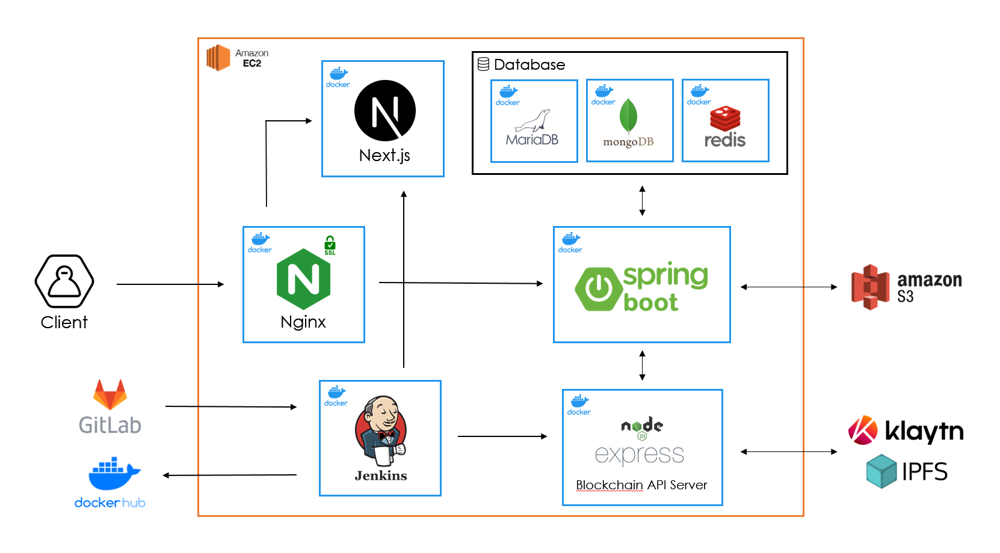
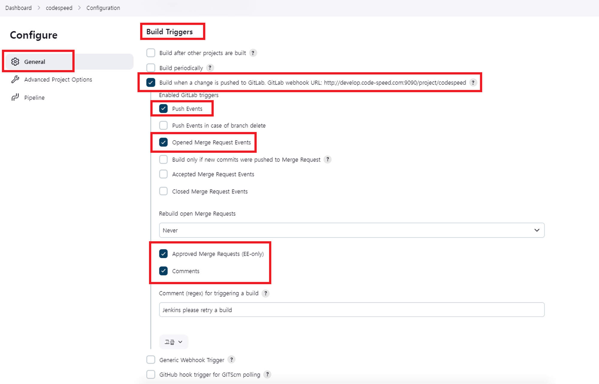
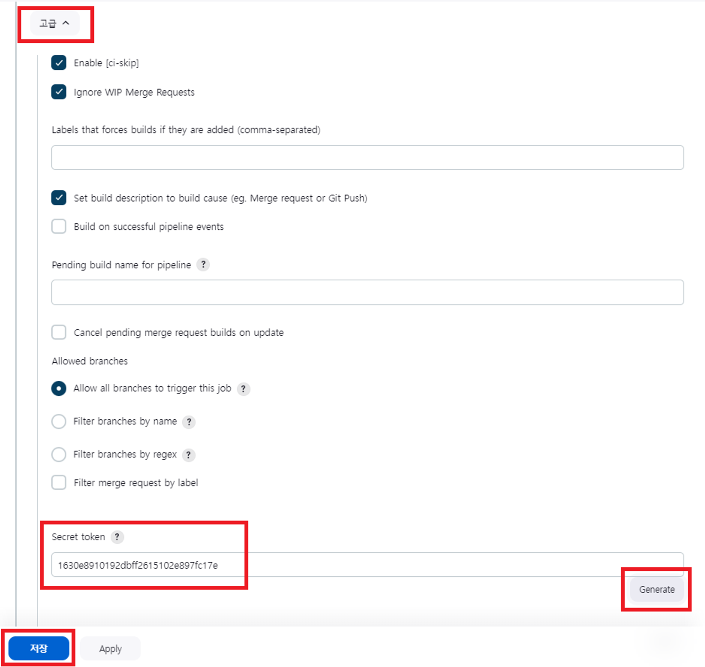
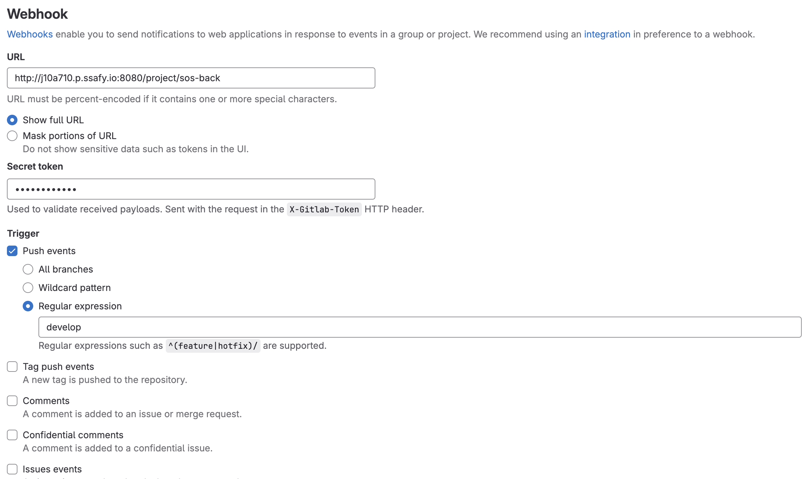
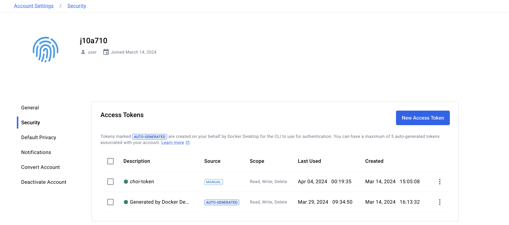
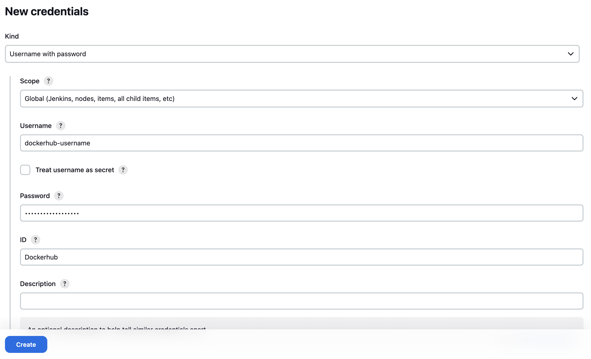
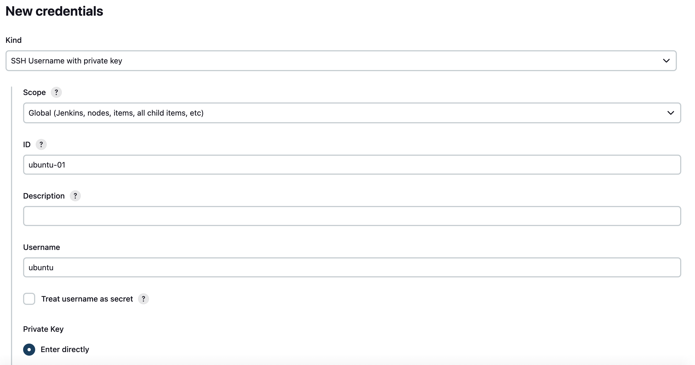

# Sea of Secret(SOS) 포팅 메뉴얼

`Sea of Secret(SOS)` 서비스의 빌드 및 배포를 위한 문서입니다.


## 목차

### 1. 개발 환경

### 2. 서비스 아키텍처

### 3. 배포 환경 구축

### 4. CI/CD


## 1. 개발 환경

- Front-End
- Back-End

|    Tech     | Version |
| :---------: | :-----: |
|    Java     |   17    |
| Spring Boot |  3.2.3  |
|   gradle    |   8.5   |
|   MariaDB   | 11.3.2  |
|   MongoDB   |  7.0.6  |
|    Redis    |  7.2.4  |


- Blockchain Api Server


## 2. 서비스 아키텍처




## 3. 배포 환경 구축

### Ubuntu 서버 설정

- 우분투 서버 시간을 한국 시간으로 설정 (UTC+9)

```
sudo timedatectl set-timezone Asia/Seoul
```

- 미러 서버를 카카오 서버로 변경(속도 개선)

```
sudo sed -i 's/ap-northeast-2.ec2.archive.ubuntu.com/mirror.kakao.com/g' /etc/apt/sources.list
```

- 패키지 목록 업데이트 및 업그레이드

```
sudo apt-get -y update && sudo apt-get -y upgrade
```


### Docker 설치

- Docker 설치 전 필요한 패키지 설치

```
sudo apt-get -y install apt-transport-https ca-certificates curl gnupg-agent software-properties-common
```

- Docker에 대한 GPC Key 인증 진행

```
curl -fsSL https://download.docker.com/linux/ubuntu/gpg | sudo apt-key add -
```

- Docker 레포지토리 등록

```
sudo add-apt-repository "deb [arch=amd64] https://download.docker.com/linux/ubuntu $(lsb_release -cs) stable"
```

- 패키지 리스트 갱신

```
sudo apt-get -y update
```

- Docker 패키지 설치
  - docker-ce: Docker Community Edition의 약자
  - docker-ce-cli: Docker Community Edition의 CLI 환경에서 추가로 설치해야 하는 패키지
  - [containerd.io](http://containerd.io): Docker 컨테이너 런타임

```
sudo apt-get -y install docker-ce docker-ce-cli containerd.io
```

- Docker 일반 유저에게 권한 부여Docker 일반 유저에게 권한 부여(sudo 없이 명령어 사용 가능)

```
sudo usermod -aG docker ubuntu
```

- Docker 서비스 재시작(사용자 세션 재로그인 필요)

```
sudo service docker restart
```


### Jenkins 설치(DinD 방식)

- Jenkins 이미지 받기(Java 17)

```
docker pull jenkins/jenkins:jdk17
```

- Jenkins 컨테이너 실행

```
docker run -d --restart always --env JENKINS_OPTS=--httpPort=8080 -v /etc/localtime:/etc/localtime:ro -e TZ=Asia/Seoul -p 8080:8080 -v /jenkins:/var/jenkins_home -v /var/run/docker.sock:/var/run/docker.sock --name jenkins -u root jenkins/jenkins:jdk17
```

- Jenkins 컨테이너 종료

```
sudo docker stop jenkins
```

- Jenkins 데이터가 있는 디렉토리에 `update-center-rootCAs` 하위 디렉토리 생성

```
sudo mkdir /jenkins/update-center-rootCAs
```

- CA 파일 다운로드

```
sudo wget https://cdn.jsdelivr.net/gh/lework/jenkins-update-center/rootCA/update-center.crt -O /jenkins/update-center-rootCAs/update-center.crt
```

- Jenkins 플러그인 다운로드 시 미러사이트로 대체될 수 있도록 설정

```
sudo sed -i 's#https://updates.jenkins.io/update-center.json#https://raw.githubusercontent.com/lework/jenkins-update-center/master/updates/tencent/update-center.json#' /jenkins/hudson.model.UpdateCenter.xml
```

- Jenkins 컨테이너 재시작

```
sudo docker restart jenkins
```

- Jenkins 접속 후 비밀번호 입력

```
# 1. log로 확인(시간이 지나면 뭍힘)
docker logs [jenkins container name]

# 2. /var/jenkins_home/secrets/initialAdminPassword 경로 확인
# Jenkins 컨테이너 접속
docker exec -it jenkins /bin/bash

# 경로 이동
cd /var/jenkins_home/secrets

# 확인
cat initialAdminPassword
```

- Jenkins 접속 후 추천 플러그인 설치 및 기타 설정

- Jenkins 컨테이너 접속 후 Docker Repository 등록 및 docker-ce 패키지 설치

```
docker exec -it jenkins /bin/bash

apt-get update && apt-get -y install apt-transport-https ca-certificates curl gnupg2 software-properties-common && curl -fsSL https://download.docker.com/linux/$(. /etc/os-release; echo "$ID")/gpg > /tmp/dkey; apt-key add /tmp/dkey && add-apt-repository "deb [arch=amd64] https://download.docker.com/linux/$(. /etc/os-release; echo "$ID") $(lsb_release -cs) stable" && apt-get update && apt-get -y install docker-ce
```

- Docker Jenkins에서 Host Docker 접근권한 부여

```
groupadd -f docker
usermod -aG docker jenkins
chown root:docker /var/run/docker.sock
```

- Jenkins 플러그인 설치

```
# ssh 커맨드 입력에 사용
SSH Agent

# docker 이미지 생성에 사용
Docker
Docker Commons
Docker Pipeline
Docker API

# 웹훅을 통해 브랜치 merge request 이벤트 발생시 Jenkins 자동 빌드에 사용
Generic Webhook Trigger

# 타사 레포지토리 이용시 사용 (GitLab, Github 등)
GitLab
GitLab API
GitLab Authentication
GitHub Authentication

# Node.js 빌드시 사용
NodeJS

# 웹훅을 감지하고 Jenkins 작업을 트리거하는 데 사용
Generic Webhook Trigger
```


### nginx 설치(with https)

- Doker로 Certbot 실행

```
docker run -it --rm -v /etc/letsencrypt:/etc/letsencrypt -v /var/lib/letsencrypt:/var/lib/letsencrypt --network=host certbot/certbot certonly
```

- default.conf(/etc/nginx/default.conf)

```
server {
    listen 80;
    server_name j10a710.p.ssafy.io;

    location / {
        return 301 https://$host$request_uri;
    }
}

server {
    listen 443 ssl;
    server_name j10a710.p.ssafy.io;

    ssl_certificate /etc/letsencrypt/live/j10a710.p.ssafy.io/fullchain.pem;
    ssl_certificate_key /etc/letsencrypt/live/j10a710.p.ssafy.io/privkey.pem;

    client_max_body_size 5M;

    proxy_set_header Host $http_host;
    proxy_set_header X-Real-IP $remote_addr;
    proxy_set_header X-Forwarded-For $proxy_add_x_forwarded_for;
    proxy_set_header X-Forwarded-Proto $scheme;
    proxy_set_header Upgrade $http_upgrade;
    proxy_set_header Connection "upgrade";
    #proxy_cache_bypass $cookie_nocache $arg_nocache $http_pragma $http_authorization $http_upgrade;

    location / {
        proxy_pass http://j10a710.p.ssafy.io:3000;
    }

    location /next {
        rewrite ^/next(.*)$ $1 break;
        proxy_pass http://j10a710.p.ssafy.io:3000;
    }

    location /spring {
        rewrite ^/spring(.*)$ $1 break;
        proxy_pass http://j10a710.p.ssafy.io:8081;
        #proxy_cookie_path /api "/; samesite=none; HttpOnly";
    }
}
```

- nginx 실행

```
docker run -d --restart always -p 80:80 -p 443:443 -e TZ=Asia/Seoul -v /etc/letsencrypt:/etc/letsencrypt -v /etc/nginx/default.conf:/etc/nginx/conf.d/default.conf --name nginx -u root nginx:latest
```


### MariaDB 설치

- MariaDB 컨테이너 실행

```
docker run -d --restart always -p 3306:3306 -e MYSQL_ROOT_PASSWORD=비밀번호 -v /var/lib/mysql:/var/lib/mysql --name mariadb mariadb
```


### MongoDB 설치

- MongoDB 컨테이너 실행

```
docker run -d --restart always -p 27017:27017 --name mongo mongo
```


### Redis 설치

- Redis 컨테이너 실행

```
docker run -d --restart always -p 6379:6379 --name redis redis
```


## 4. CI/CD

### Web hook 설정

- Jenkins Job Build Triggers 설정



- Secret token 발행



- Gitlab Webhook 지정




### Docker Hub

- Dokcerhub Access Token 발행 및 레파지토리 생성



- Jenkins/Credentials 등록




### Ubuntu Credential

- Jenkins/Credentials 등록



- *.pem 내용


### Front-End 배포 (Nextjs)

- Dockerfile

```
FROM node:18-alpine AS runner

WORKDIR /usr/src/app

COPY ./.next/standalone ./
COPY ./public ./public
COPY ./.next/static ./.next/static

CMD ["node", "server.js"]
```

- Jenkins Pipeline Script

```
pipeline {
    agent any

    tools {
        nodejs 'nodejs'
    }

    environment {
        releaseServerAccount = 'ubuntu'
        releaseServerUri = ''
        registryCredential = 'dockerhub'
        imageName = 'j10a710/sos-front'
        serviceName = 'sos-front'
    }

    stages {
        stage('Git Clone') {
            steps {
                git branch: 'develop', credentialsId: 'gitlab', url: 'https://lab.ssafy.com/s10-blockchain-nft-sub2/S10P22A710.git'
            }
        }
        stage('Node Build') {
            steps {
                script {
                    def commitDiff = sh(script: "git diff --name-only HEAD^ HEAD", returnStdout: true).trim()
                    def commitFiles = commitDiff.split('\n')

                    boolean commitInFolder = false  

                    for (file in commitFiles) {
                        if (file.startsWith('frontend/')) {
                            commitInFolder = true
                            break
                        }
                    }

                    if (!commitInFolder) {
                        error("No changes found in the frontend folder. Aborting the build.")
                    }


                    dir ('frontend') {
                        sh '''
                            touch .env
                            echo "SERVER_API_END_POINT=${SERVER_API_END_POINT}" >> .env
                            echo "SERVER_SOCKET_API_END_POINT=${SERVER_SOCKET_API_END_POINT}" >> .env
                            echo "CLIENT_API_END_POINT=${CLIENT_API_END_POINT}" >> .env
                            echo "NEXT_PUBLIC_API_END_POINT=${NEXT_PUBLIC_API_END_POINT}" >> .env
                            echo "NEXT_PUBLIC_CLIENT_API_END_POINT=${NEXT_PUBLIC_CLIENT_API_END_POINT}" >> .env
                        '''
                        
                        sh 'npm install'
                        sh 'GENERATE_SOURCEMAP=false npm run build'
                    }
                }
            }
        }

        stage('Image Build & Docker Hub Push') {
            steps {
                dir('frontend') {
                    script {
                        docker.withRegistry('', registryCredential) {
                            sh "docker buildx create --use --name mybuilder"
                            sh "docker buildx build --platform linux/amd64 -t $imageName:$BUILD_NUMBER --push ."
                            sh "docker buildx build --platform linux/amd64 -t $imageName:latest --push ."
                        }
                    }
                }
            }
        }

        stage('Before Service Stop') {
            steps {
                sshagent(credentials: ['ubuntu']) {
                    sh '''
                    if test "`ssh -o StrictHostKeyChecking=no $releaseServerAccount@$releaseServerUri "docker ps -aq --filter ancestor=$imageName:latest"`"; then
                        ssh -o StrictHostKeyChecking=no $releaseServerAccount@$releaseServerUri "docker stop $(docker ps -aq --filter ancestor=$imageName:latest)"
                        ssh -o StrictHostKeyChecking=no $releaseServerAccount@$releaseServerUri "docker rm -f $(docker ps -aq --filter ancestor=$imageName:latest)"
                        ssh -o StrictHostKeyChecking=no $releaseServerAccount@$releaseServerUri "docker rmi $imageName:latest"
                    fi
                    '''
                }
            }
        }

        stage('DockerHub Pull') {
            steps {
                sshagent(credentials: ['ubuntu']) {
                    sh "ssh -o StrictHostKeyChecking=no $releaseServerAccount@$releaseServerUri 'sudo docker pull $imageName:latest'"
                }
            }
        }

        stage('Service Start') {
            steps {
                sshagent(credentials: ['ubuntu']) {
                    sh """
                        ssh -o StrictHostKeyChecking=no $releaseServerAccount@$releaseServerUri 'sudo docker run -i -p 3000:3000 -e TZ=Asia/Seoul --name $serviceName -d $imageName:latest'
                    """
                }
            }
        }
    }
}
```

- Jenkins 환경 변수(Jenkins/System)

```
NEXT_PUBLIC_CLIENT_API_END_POINT=${CLIENT}
NEXT_PUBLIC_SERVER_API_END_POINT=${SERVER}
NEXT_PUBLIC_SERVER_SOCKET_API_END_POINT=${SERVER_SOCKET}
```

- nodejs 빌드 툴 설정(Jenkins/Tools)
  - node plugin을 인식 못하는 경우 사용


### Back-End 배포(Spring Boot)

- yml(Jenkins/Credentials)

  - application.yml

  ```
  server:
    port: 8080
    servlet:
      context-path: /api
      session:
        cookie:
          path: /
  
  spring:
    config:
      import:
        - application-datasource.yml
        - application-s3.yml
        - application-oauth.yml
        - application-jwt.yml
    servlet:
      multipart:
        max-file-size: 5MB
  
  logging:
    level:
      org.springframework.security: DEBUG
  
  ```

  - application-datasource.yml

  ```
  spring:
    datasource:
      driver-class-name: com.mysql.cj.jdbc.Driver
      url: jdbc:mysql://{SERVER_ADDRESS}:3306/sos?serverTimezone=UTC&characterEncoding=UTF-8
      username: {MARIADB_USERNAME}
      password: {MARIADB_PASSWORD}
    jpa:
      show-sql: false
      hibernate:
        ddl-auto: update
      properties:
        hibernate:
          format_sql: true
    data:
      redis:
        port: 6379
        host: {SERVER_ADDRESS}
        password: {REDIS_PASSWORD}
      mongodb:
        host: {SERVER_ADDRESS}
        port: 27017
        authentication-database: admin
        username: {MONGODB_USERNAME}
        password: {MONGODB_PASSWORD}
        database: sos
  logging:
    level:
      org:
        springframework:
          security: DEBUG
  ```

  - application-s3.yml

  ```
  cloud:
    aws:
      s3:
        bucket: {S3_BUCKET}
        base-url: {S3_BASE_URL}
      credentials:
        access-key: {ACCESS_KEY}
        secret-key: {SECRET_KEY}
      region:
        static: ap-northeast-2
        auto: false
      stack:
        auto: false
  
  ```

  - application-oauth.yml

  ```
  spring:
    security:
      oauth2:
        client:
          registration:
            kakao:
              client-id: {KAKAO_CLIENT_ID}
              client-secret: {KAKAO_CLIENT_SECRET}
              redirect-uri: {KAKAO_REDIRECT_URI}
              client-name: kakao
              authorization-grant-type: authorization_code
              client-authentication-method: client_secret_post
              provider: kakao
              scope:
                - profile_nickname
                - account_email
  
            naver:
              client-id: {NAVER_CLIENT_ID}
              client-secret: {NAVER_CLIENT_SECRET}
              redirect-uri: {NAVER_REDIRECT_URI}
              client-name: naver
              authorization-grant-type: authorization_code
              scope: name,email
  
            google:
              client-id: {GOOGLE_CLIENT_ID}
              client-secret: {GOOGLE_CLIENT_SECRET}
              redirect-uri: {GOOGLE_REDIRECT_URI}
              client-name: google
              authorization-grant-type: authorization_code
              scope: profile,email
  
          provider:
            kakao:
              authorization-uri: https://kauth.kakao.com/oauth/authorize
              token-uri: https://kauth.kakao.com/oauth/token
              user-info-uri: https://kapi.kakao.com/v2/user/me
              user-name-attribute: id
  
            naver:
              authorization-uri: https://nid.naver.com/oauth2.0/authorize
              token-uri: https://nid.naver.com/oauth2.0/token
              user-info-uri: https://openapi.naver.com/v1/nid/me
              user-name-attribute: response
  ```

  - application-jwt.yml

  ```
  spring:
    jwt:
      secret: {JWT_SECRET_KEY}
  ```

- Dockerfile

```
FROM openjdk:17-alpine

ADD ./build/libs/*.jar app.jar

ENTRYPOINT ["java", "-jar", "/app.jar"]
```

- Jenkins Pipeline Script

```
pipeline {
    agent any

    environment {
        releaseServerAccount = 'ubuntu'
        releaseServerUri = ''
        registryCredential = 'dockerhub'
        imageName = 'j10a710/sos-back'
        serviceName = 'sos-back'
    }

    stages {
        stage('Git Clone') {
            steps {
                git branch: 'develop', credentialsId: 'gitlab', url: 'https://lab.ssafy.com/s10-blockchain-nft-sub2/S10P22A710.git'
            }
        }

        stage('Jar Build with Gradle') {
            steps {
                script {
                    def commitDiff = sh(script: "git diff --name-only HEAD^ HEAD", returnStdout: true).trim()
                    def commitFiles = commitDiff.split('\n')

                    boolean commitInFolder = false  

                    for (file in commitFiles) {
                        if (file.startsWith('backend/')) {
                            commitInFolder = true
                            break
                        }
                    }

                    if (!commitInFolder) {
                        error("No changes found in the backend folder. Aborting the build.")
                    }


                    dir ('backend') {
                        withCredentials([
                                file(credentialsId: 'application', variable: 'application_yml'),
                                file(credentialsId: 'application-datasource', variable: 'application_datasource_yml'),
                                file(credentialsId: 'application-s3', variable: 'application_s3_yml'),
                                file(credentialsId: 'application-oauth', variable: 'application_oauth_yml'),
                                file(credentialsId: 'application-jwt', variable: 'application_jwt_yml'),
                        ]) {
                            sh "cp $application_yml src/main/resources/application.yml"
                            sh "cp $application_datasource_yml src/main/resources/application-datasource.yml"
                            sh "cp $application_s3_yml src/main/resources/application-s3.yml"
                            sh "cp $application_oauth_yml src/main/resources/application-oauth.yml"
                            sh "cp $application_jwt_yml src/main/resources/application-jwt.yml"
                        }

                        sh 'chmod +x ./gradlew'
                        sh './gradlew clean bootJar'
                    }
                }
            }
        }

        stage('Image Build & Docker Hub Push') {
            steps {
                dir('backend') {
                    script {
                        docker.withRegistry('', registryCredential) {
                            sh "docker buildx create --use --name mybuilder"
                            sh "docker buildx build --platform linux/amd64 -t $imageName:$BUILD_NUMBER --push ."
                            sh "docker buildx build --platform linux/amd64 -t $imageName:latest --push ."
                        }
                    }
                }
            }
        }

        stage('Before Service Stop') {
            steps {
                sshagent(credentials: ['ubuntu']) {
                    sh '''
                    if test "`ssh -o StrictHostKeyChecking=no $releaseServerAccount@$releaseServerUri "docker ps -aq --filter ancestor=$imageName:latest"`"; then
                        ssh -o StrictHostKeyChecking=no $releaseServerAccount@$releaseServerUri "docker stop $(docker ps -aq --filter ancestor=$imageName:latest)"
                        ssh -o StrictHostKeyChecking=no $releaseServerAccount@$releaseServerUri "docker rm -f $(docker ps -aq --filter ancestor=$imageName:latest)"
                        ssh -o StrictHostKeyChecking=no $releaseServerAccount@$releaseServerUri "docker rmi $imageName:latest"
                    fi
                    '''
                }
            }
        }

        stage('DockerHub Pull') {
            steps {
                sshagent(credentials: ['ubuntu']) {
                    sh "ssh -o StrictHostKeyChecking=no $releaseServerAccount@$releaseServerUri 'sudo docker pull $imageName:latest'"
                }
            }
        }

        stage('Service Start') {
            steps {
                sshagent(credentials: ['ubuntu']) {
                    sh """
                        ssh -o StrictHostKeyChecking=no $releaseServerAccount@$releaseServerUri 'sudo docker run -i -p 8081:8081 -e TZ=Asia/Seoul -e SPRING_PROFILES_ACTIVE=prod --name $serviceName -d $imageName:latest'
                    """
                }
            }
        }
    }
}
```


### Blockchain Api Service 배포 (Expressjs)

- Dockerfile

```
FROM node:18-alpine AS runner

WORKDIR /usr/src/app

COPY . .

EXPOSE 4000

CMD ["npm", "start"]
```

- Jenkins Pipeline Script

```
pipeline {
    agent any

    tools {
        nodejs 'nodejs'
    }

    environment {
        releaseServerAccount = 'ubuntu'
        releaseServerUri = ''
        registryCredential = 'dockerhub'
        imageName = 'j10a710/sos-nft'
        serviceName = 'sos-nft'
    }

    stages {
        stage('Git Clone') {
            steps {
                git branch: 'develop', credentialsId: 'gitlab', url: 'https://lab.ssafy.com/s10-blockchain-nft-sub2/S10P22A710.git'
            }
        }
        stage('Node Build') {
            steps {
                script {
                    def commitDiff = sh(script: "git diff --name-only HEAD^ HEAD", returnStdout: true).trim()
                    def commitFiles = commitDiff.split('\n')

                    boolean commitInFolder = false  

                    for (file in commitFiles) {
                        if (file.startsWith('NFTBackend/')) {
                            commitInFolder = true
                            break
                        }
                    }

                    if (!commitInFolder) {
                        error("No changes found in the frontend folder. Aborting the build.")
                    }


                    dir ('NFTBackend') {
                        sh 'npm install'
                    }
                }
            }
        }

        stage('Image Build & Docker Hub Push') {
            steps {
                dir('NFTBackend') {
                    script {
                        docker.withRegistry('', registryCredential) {
                            sh "docker buildx create --use --name mybuilder"
                            sh "docker buildx build --platform linux/amd64 -t $imageName:$BUILD_NUMBER --push ."
                            sh "docker buildx build --platform linux/amd64 -t $imageName:latest --push ."
                        }
                    }
                }
            }
        }

        stage('Before Service Stop') {
            steps {
                sshagent(credentials: ['ubuntu']) {
                    sh '''
                    if test "`ssh -o StrictHostKeyChecking=no $releaseServerAccount@$releaseServerUri "docker ps -aq --filter ancestor=$imageName:latest"`"; then
                        ssh -o StrictHostKeyChecking=no $releaseServerAccount@$releaseServerUri "docker stop $(docker ps -aq --filter ancestor=$imageName:latest)"
                        ssh -o StrictHostKeyChecking=no $releaseServerAccount@$releaseServerUri "docker rm -f $(docker ps -aq --filter ancestor=$imageName:latest)"
                        ssh -o StrictHostKeyChecking=no $releaseServerAccount@$releaseServerUri "docker rmi $imageName:latest"
                    fi
                    '''
                }
            }
        }

        stage('DockerHub Pull') {
            steps {
                sshagent(credentials: ['ubuntu']) {
                    sh "ssh -o StrictHostKeyChecking=no $releaseServerAccount@$releaseServerUri 'sudo docker pull $imageName:latest'"
                }
            }
        }

        stage('Service Start') {
            steps {
                sshagent(credentials: ['ubuntu']) {
                    sh """
                        ssh -o StrictHostKeyChecking=no $releaseServerAccount@$releaseServerUri 'sudo docker run -i -p 4000:4000 -e TZ=Asia/Seoul --name $serviceName -d $imageName:latest'
                    """
                }
            }
        }
    }
}
```


